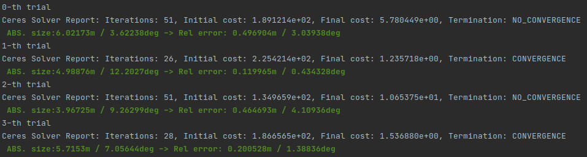

<div align="center">
<h1>PCL Tutorial (한글.ver)</h1>

<a href="https://limhyungtae.github.io/pcl_tutorial/"></a>


<p align="center"></p>

<p><strong><em>Point Cloud Library(PCL)를 어떻게 잘 쓰는지에 초점을 맞춘 한글 튜토리얼.</em></strong></p>
</div>

[English](README.md) · **한국어**

______________________________________________________________________

## :rocket: 개요

수식적인 optimization 유도나 C++ 문법에 대한 깊은 설명보다는, **실제로 어떻게 잘 쓰는지**에 무게를 둔 튜토리얼입니다.
각 챕터는 [블로그 글](https://limhyungtae.github.io/)과 1:1로 매칭되며, 이 레포는 그 글에 등장하는 모든 코드의 유지보수용 저장소입니다.

- Original author: Hyungtae Lim (`shapelim` at `mit` dot `edu`)
- Tested OS: Ubuntu 24.04

______________________________________________________________________

## :sparkles: 인터랙티브 데모 (`web/`)

브라우저에서 슬라이더를 만져 가며 챕터별 동작을 직접 확인할 수 있습니다 — **<https://limhyungtae.github.io/pcl_tutorial/>**.

모든 인터랙티브 데모는 **TypeScript로 재구현된 알고리즘이 브라우저에서 실시간으로** 돕니다 (외부 컴퓨트 없음). 입력은 KITTI(Outdoor LiDAR) / NaverLabs(Indoor LiDAR) / Stanford Bunny(CAD) 프리셋 + 자유 드래그&드롭.

| #  | 챕터                                  | 핵심                                                |
| -- | ------------------------------------- | --------------------------------------------------- |
| 1  | Voxelization                          | leaf size 슬라이더, before/after 카메라 동기화      |
| 2  | PassThrough                           | 축 + min/max + negative 토글, before/after 동기화   |
| 3  | Transformation                        | tx/ty/tz/rx/ry/rz, 진입 시 랜덤 offset              |
| 4  | Statistical Outlier Removal           | mean K + stddev mult, 인라이어/아웃라이어 분리       |
| 5  | Radius Search                         | KdTree 기반; 점 클릭으로 쿼리 설정                   |
| 6  | K-Nearest Neighbor                    | KdTree 기반 K-NN; 점 클릭으로 쿼리 설정              |
| 7  | Normal Estimation                     | KdTree + SVD; normal을 흰색 선으로 시각화            |
| 8  | RANSAC Plane Segmentation             | 지면/벽 검출 (extra)                                |
| 9  | **Patchwork** — 지면 분할             | CZM zone × ring 별로 색을 달리해 시각화 (VLP-16/HDL-64) |
| 10 | Euclidean Clustering                  | 슬라이더 변화에도 cluster별 색이 유지됨 (extra)      |
| 11 | **TRAVEL** — Range Image Clustering   | 3D + 2D range image, 동일 cluster 색 (VLP-16/HDL-64) |
| 12 | Iterative Closest Point               | **Step / Play로 매 iteration의 짝과 pose update 관찰** |

> 9번과 11번 챕터는 센서 의존적 데모입니다: VLP-16 (NaverLabs 프리셋)과 HDL-64 (KITTI 프리셋)에 대한 파라미터만 내장되어 있습니다. 자체 데이터로 돌리려면 각 페이지의 caution box에 링크된 원본 [Patchwork](https://github.com/LimHyungTae/patchwork) / [TRAVEL](https://github.com/url-kaist/TRAVEL) 레포를 참고하세요.

### 로컬에서 사이트 띄우기

```bash
cd web
npm install
npm run dev          # http://localhost:5173/pcl_tutorial/
```

`predev` / `prebuild` 훅이 `materials/`의 데이터(`.bin` / `.pcd` / `.ply`)를 자동으로 `web/public/data/`로 복사합니다.

### 배포

`main` 브랜치에 `web/**` 변경이 push되면 GitHub Actions(`.github/workflows/deploy.yml`)가 자동으로 빌드 후 GitHub Pages에 배포합니다. 첫 배포 전에는 GitHub repo settings → Pages → Source를 **GitHub Actions**로 설정해 주세요.

______________________________________________________________________

## :hammer: Prerequisites & Build

### Prerequisites

- CMake ≥ 3.10
- PCL ≥ 1.8
- Boost ≥ 1.58

### Build

```bash
mkdir build && cd build
cmake ..
make -j$(nproc)
```

빌드 단계에서 `materials/` 안의 데이터(`.bin`, `.pcd`, `.ply`)가 `build/auxiliary/`로 자동 복사되므로,
실행 파일은 항상 `build/` 디렉토리 **내부에서** 실행해 주세요.

```bash
cd build
./lec00_usage
./lec04_visualization
# ...
```

______________________________________________________________________

## :books: 챕터별 코드 & 블로그 글

| #     | 코드                                                                                | 주제                                | 블로그 글                                                                                                                                                                                                  |
| :---: | :-----------------------------------------------------------------------------------: | :-----------------------------------: | :---------------------------------------------------------------------------------------------------------------------------------------------------------------------------------------------------------- |
| 0     | [`lec00_usage.cpp`](lec00_usage.cpp)                                                | PCL 기본 사용법                     | [0. Tutorial 및 기본 사용법](https://limhyungtae.github.io/2021-09-09-ROS-Point-Cloud-Library-(PCL)-0.-Tutorial-및-기본-사용법/)                                                                          |
| 1-1   | [`lec01_1_shared_ptr.cpp`](lec01_1_shared_ptr.cpp)                                  | `shared_ptr` 기본                   | [1-(1). Ptr/ConstPtr의 완벽 이해 — `shared_ptr`](https://limhyungtae.github.io/2021-09-09-ROS-Point-Cloud-Library-(PCL)-1.-Ptr,-ConstPtr의-완벽-이해-(1)-shared_ptr/)                                     |
| 1-2   | [`lec01_2_ptr.cpp`](lec01_2_ptr.cpp)                                                | PCL에서의 Ptr 사용                  | [1-(2). Ptr/ConstPtr의 완벽 이해 — Ptr in PCL](https://limhyungtae.github.io/2021-09-10-ROS-Point-Cloud-Library-(PCL)-1.-Ptr,-ConstPtr의-완벽-이해-(2)-Ptr-in-PCL/)                                       |
| 1-3   | [`lec01_3_ptr_in_class.cpp`](lec01_3_ptr_in_class.cpp)                              | 클래스 멤버변수 Ptr                 | [1-(3). Ptr/ConstPtr의 완벽 이해 — Ptr in 클래스 멤버변수](https://limhyungtae.github.io/2021-09-10-ROS-Point-Cloud-Library-(PCL)-1.-Ptr,-ConstPtr의-완벽-이해-(3)-Ptr-in-클래스-멤버변수/)               |
| 2     | *(코드 없음)*                                                                       | 형변환 — `toROSMsg` / `fromROSMsg` | [2. 형변환 — toROSMsg, fromROSMsg](https://limhyungtae.github.io/2021-09-10-ROS-Point-Cloud-Library-(PCL)-2.-형변환-toROSMsg,-fromROSMsg/)                                                                |
| 3     | [`lec03_transformation.cpp`](lec03_transformation.cpp)                              | 4×4 행렬 기반 변환                  | [3. Transformation](https://limhyungtae.github.io/2021-09-10-ROS-Point-Cloud-Library-(PCL)-3.-Transformation/)                                                                                              |
| 4     | [`lec04_visualization.cpp`](lec04_visualization.cpp)                                | PCLVisualizer 사용법                | [4. Viewer로 visualization하는 법](https://limhyungtae.github.io/2021-09-10-ROS-Point-Cloud-Library-(PCL)-4.-Viewer로-visualization하는-법/)                                                              |
| 5     | [`lec05_voxelization.cpp`](lec05_voxelization.cpp)                                  | Voxel Grid 필터링                   | [5. Voxelization](https://limhyungtae.github.io/2021-09-12-ROS-Point-Cloud-Library-(PCL)-5.-Voxelization/)                                                                                                  |
| 6     | [`lec06_pass_through.cpp`](lec06_pass_through.cpp)                                  | PassThrough 필터링                  | [6. PassThrough](https://limhyungtae.github.io/2021-09-12-ROS-Point-Cloud-Library-(PCL)-6.-PassThrough/)                                                                                                    |
| 7     | [`lec07_sor.cpp`](lec07_sor.cpp)                                                    | Statistical Outlier Removal         | [7. Statistical Outlier Removal](https://limhyungtae.github.io/2021-09-12-ROS-Point-Cloud-Library-(PCL)-7.-Statistical-Outlier-Removal/)                                                                    |
| 8     | [`lec08_radius_search.cpp`](lec08_radius_search.cpp)                                | KdTree 기반 Radius Search           | [8. KdTree를 활용한 Radius Search](https://limhyungtae.github.io/2021-09-12-ROS-Point-Cloud-Library-(PCL)-8.-KdTree를-활용한-Radius-Search/)                                                              |
| 9     | [`lec09_knn.cpp`](lec09_knn.cpp)                                                    | K-Nearest Neighbor Search           | [9. KdTree를 활용한 K-NN Search](https://limhyungtae.github.io/2021-09-12-ROS-Point-Cloud-Library-(PCL)-9.-KdTree를-활용한-K-nearest-Neighbor-Search-(KNN)/)                                              |
| 10-1  | [`lec10_1_normal.cpp`](lec10_1_normal.cpp)                                          | KdTree + SVD로 Normal 추정          | [10. Normal Estimation](https://limhyungtae.github.io/2021-09-13-ROS-Point-Cloud-Library-(PCL)-10.-Normal-Estimation/)                                                                                      |
| 10-2  | [`lec10_2_normal_corner.cpp`](lec10_2_normal_corner.cpp)                            | 단순 케이스의 Normal 계산           | (위 글의 corner case 예시)                                                                                                                                                                                |
| 11    | [`lec11_icp.cpp`](lec11_icp.cpp)                                                    | Iterative Closest Point             | [11. Iterative Closest Point (ICP)](https://limhyungtae.github.io/2021-09-14-ROS-Point-Cloud-Library-(PCL)-11.-Iterative-Closest-Point-(ICP)/)                                                              |
| 12    | [`lec12_gicp.cpp`](lec12_gicp.cpp)                                                  | Generalized ICP                     | [12. Generalized ICP (G-ICP)](https://limhyungtae.github.io/2021-09-14-ROS-Point-Cloud-Library-(PCL)-12.-Generalized-Iterative-Closest-Point-(G-ICP)/)                                                      |

> 참고: `auxiliary/pass_by_address.cpp`는 본 빌드에 포함되지 않은 보조 예제입니다 (Ceres + Eigen 학습용 스니펫).

______________________________________________________________________

## :file_folder: 디렉토리 구조

```
pcl_tutorial/
├── CMakeLists.txt
├── lec*.cpp                         # 챕터별 예제 코드 (PCL/C++)
├── auxiliary/                       # 본 빌드와 무관한 보조 스니펫
├── img/                             # README/블로그용 이미지
├── materials/                       # 예제용 포인트클라우드 데이터 (.bin / .pcd / .ply)
└── web/                             # React + Vite 기반 인터랙티브 사이트
    ├── src/
    │   ├── pages/                   # 챕터별 페이지
    │   ├── components/              # 뷰어, 슬라이더, 드롭존
    │   ├── i18n/                    # 영/한 사전 + 토글
    │   └── lib/                     # KdTree, PCD/BIN/PLY 파서,
    │       └── filters/             # voxel · passthrough · sor · normal ·
    │                                #   ransacPlane · euclideanCluster · icp ·
    │                                #   transform (모두 TS 재구현)
    └── public/data/                 # materials/에서 자동 복사 (build 시)
```

______________________________________________________________________

## :page_facing_up: License

MIT License. 라이선스 표기는 [`package.xml`](package.xml)을 참조하세요.
